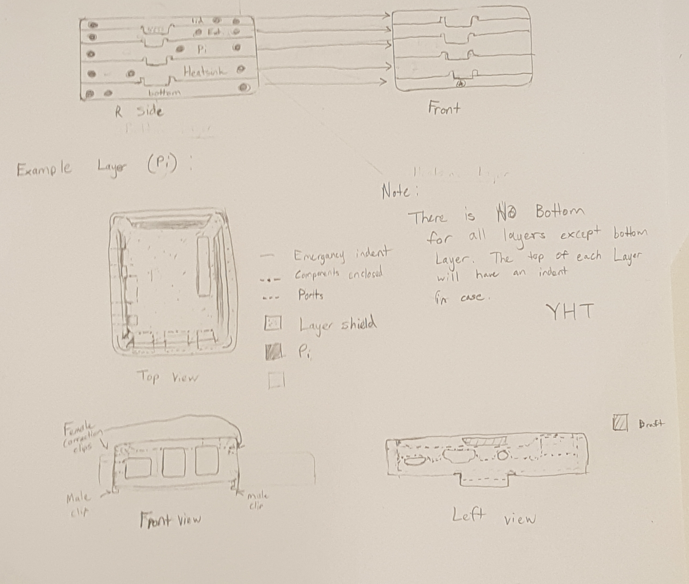

## **Please read**:
[Pre-design](docs/Pre-design.md)

# Brainstorming
## Background
  This design was inspired by the structure of stackable bento boxes and LEGOS. If one part is not needed, then it should be able to be removed and assembled again with ease. The point of this design is provide a set of stackable layers that could be customizable to fit the user's need alongside hosting the Pi. 

### **What will this model include?**
- Layered surfaces for individual internal design but same base design

- Male clips on the bottom and female indents on top for easy removal or installation of extensions (Breadboard, Hard drives, Fans, etc.)
- Heavy ventilation on the bottom layer 
- Three holes on each side for extra ventilation
- Male/female groves around the edges of the top and bottom of each case to add friction between both surfaces to ensure proper connection and prevent movement. 

### **What would it look like?**

**WARNING:** Ignore the note in the picture

**Note**: This is only a draft of the design and is subject to modification. 

### **Possible problems and solutions**:
***Problem 1***: Long design process
  
 **Possible Solutions**:
  
  1.) Make a template of the outside shell of the layer to be used for every layer 
  2.) Avoid complex designs unless for support.

# Design
- This case is specialzed to become customizable to the user's requisites. To fit this criteria, I designed a template layer for the user to create add-ons/modifications. 
- All layers contain: 
    
   - Male/female clips for easy removal/addons of components to the main case. 
   - Small extrusions on the top and bottom to help increase grip with the layers above/below. 
   - A dimension of 96mm x 54 mm x (height depends on user)

- However, for the current project we are working on, I created a specific design for two layers and the top and bottom layer case. 
## Microcomputer Layer
### Contraints & Scenarios
#### Requisites
- Easy removal of the Pi without damaging internal components. 

- Follow the [YHT principle](docs/Pre-design) to ensure optimal 3D printing performance with minimal supports required. 
- A gap of at least 0.05mm or more to allow enough movement within the system for easy removal/installation of Pi and it's components. 
- The top and bottom of the case cannot rub against the microcomputer as it could damage the case. 

#### Scenarios 
This section is for painting a picture of different situations tht would need to be taken into consideration when designing the case. 

- What if the user would like to add extensions to the Pi?
- Can the Pi link with essential components above or below it? 
- How would the user remove the microcomputer without disturbing the supports?

### Prototype features & functions
The Pi layer is comprised of two seperate components:

#### 1.) The Case

This is the main component of the layer comprised of the top section that is designed to minimalize movement. 

**NOTE:** The case must be 3D printed with the top view facing the build plate. 
 
   Features: 
    
   - **Base:** 1.25mm thick base connected to the walls of the case. The back of the base is designed to wrap around the back ports of a microcomputer to help prevent movement of the Pi when closed.

   - **Air Holes:** A large airhole throughout the flat portion of the case is designed to:
   
         1.) Improve ventilation by concentrating airflow to essential components.

         2.) Limit the area that bridging would be required on to improve 3D-printing performance and minimalize suports needed. 

         3.) Access to the GPIO pins without interfering with the supports or jeoperdizing printablity.  
    - **Threaded Holes (4):**  Located on the four corners lined up with where the four holes are located on the Pi. 
      
         **Note:** The holes located on the curved section of the top will need an 8.89mm (+/- 1%) spacer which I will design alongside the case. 

    - **Side Ribs (6):** One both sides of the top case contains sets of ribs that will help aid the 3D printing process by decreasing the amount of bridging the system will produce in turn less supports will be needed.
 

#### 2.) Pi stand

